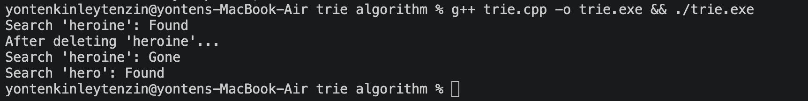
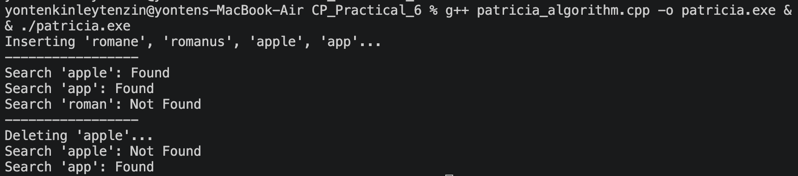
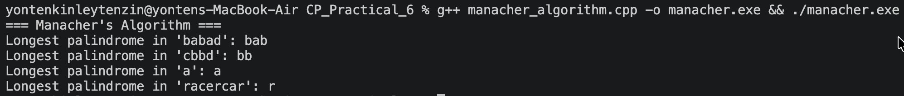

# Reflections — CP_Practical_6

### 1) Trie

**Time complexity:** O(n)

A Trie is a tree-like data structure used to store and search words by breaking them into characters. It shares a common prefixes, so similar words reuse the same path instead of being stored separately. Because of this, operations like **searching** and **inserting** are fast and depend only on the length of the word, not the number of words stored.

I also learned that Tries are very useful for things like autocomplete and dictionaries. However, one limitation is that they can use a lot of memory since each character is stored as a separate node, even when there are many nodes with only one child.

##### For example,
when storing words like "cat" and "car," both share the path "ca" and only branch at the last letter. This shows how the Trie avoids duplication by sharing prefixes.

### 2) PATRICIA Tries 

 

**Time Complexity:** O(n)

- Even though it is an optimized version of a standard Trie, it still has O(n) time complexity. However, a Patricia Trie is faster in practice because it reduces unnecessary nodes, not the amount of work per character.

A Patricia Trie is an improved version of a normal Trie that saves memory. Instead of storing one character at a time, it combines chains of nodes into one edge and stores whole parts of words. This means it skips unnecessary steps and keeps the structure smaller.

Compared to a regular Trie, which stores every character separately, a Patricia Trie stores words in chunks. Because of this, it uses less space and can be a bit faster, but it is also slightly more complex to implement.

### 3) Manacher's Algorithm

**Time complexity:** O(n) 

Manacher's Algorithm is used to find palindromic substrings in a string very efficiently. A palindrome is a word that reads the same forward and backward. What makes this algorithm special is that it can find the longest palindrome in linear time, which is much faster than other methods like a brute force and Rabin karp.

I learned that it works by using symmetry and expanding around the center, while reusing previous results to avoid repeating the same checks. This is why it is faster than brute force or dynamic programming, which take O(n²) time.

Another key idea is preprocessing the string by adding special characters between letters. This helps handle both odd and even length palindromes in the same way and keeps the logic simple.

Overall, I understood that this algorithm is efficient because it reduces unnecessary comparisons and works well even for large strings.

#### For example 

- Longest palindrome in "babad" -> "bab"
- Longest palindrome in "cbbd" -> "bb"
- Longest palindrome in "a" -> "a"
- Longest palindrome in "racercar" -> "r"

These results show how the algorithm efficiently finds the longest palindromic substring for different inputs.

