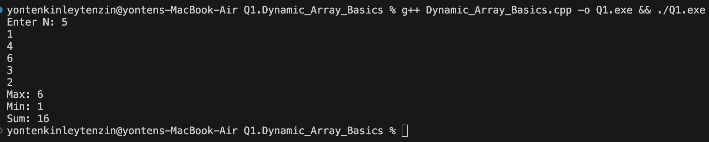

## a. Problem Summery 
The program will prompt the user to enter an integer, N, which represents how many numbers they want to input. After the user provides those N numbers, the program processes them to find and display the minimum value, the maximum value, and the total sum of the entire set.

## b. Algorithm Explanation
The logic follows a straightforward linear approach:
1. Input Collection: It reads N values into a std::vector.
2. Initialization: It initializes max and min variables with the first element of the vector to establish a baseline for comparison.
3. Linear Traversal: It iterates through the entire vector exactly once. During this single pass:
- It adds the current element to a sum accumulator.
- It compares the current element against the current max and min, updating them if a larger or smaller value is found.
4. Output: Finally, it prints the computed statistics to the console.

## c. Time Complexity Analysis
The time complexity is O(n).
- The first loop runs N times to take input.
- The second loop runs N times to calculate the sum, min, and max.
- Since these loops are sequential (not nested), the total work is proportional to 2N, which simplifies to O(N) in Big O notation.

## d. Space Complexity Analysis
Space complexity is O(N), Because
- The program stores all N numbers in a vector (list).
- If user enters more numbers → more memory is needed.
So memory usage grows with N.

## e. Reflection
This problem helped me understand how to write a more efficient program by using a single loop to perform multiple tasks at the same time. Instead of using separate loops to find the minimum value, maximum value, and total sum, all these operations were done in one pass through the list of numbers. This makes the program faster and reduces unnecessary work for the computer. I also learned the importance of initializing the minimum and maximum variables with the first element of the input list rather than using a fixed value like 0, because doing so can give incorrect results when all the input numbers are negative. Overall, this problem improved my understanding of loops, vectors, and how to optimize program performance in a simple and practical way.